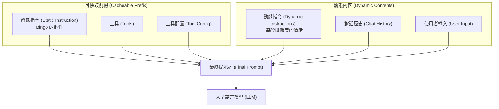
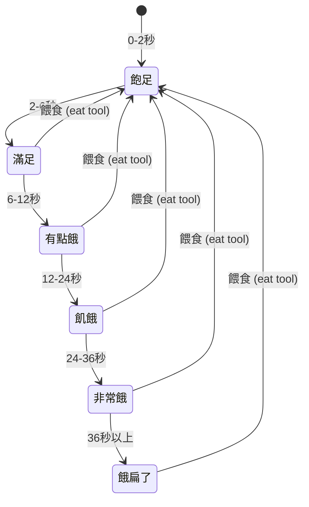

# Bingo 數位寵物代理 (Bingo Digital Pet Agent)

這個範例代理程式透過一隻可愛的數位寵物 Bingo 展示了**靜態指令 (Static Instruction)** 的功能！該代理程式展示了如何將靜態指令（個性）放置在 `system_instruction` 中以便進行快取，而動態指令則添加到使用者內容中，進而影響最終模型提示詞 (Prompt) 的可快取前綴 (Cacheable Prefix)。

**提示詞構建與快取 (Prompt Construction & Caching)**：最終的模型提示詞構建方式為：`system_instruction + tools + tool_config + contents`。靜態指令放在 `system_instruction` 中，而動態指令則附加到使用者內容中（這些內容與歷史對話記錄一起屬於 `contents` 的一部分）。這意味著前綴（`system_instruction + tools + tool_config`）保持可快取狀態，而只有 `contents` 部分在請求之間發生變化。

## 流程圖



## 功能特點

### 靜態指令 (Bingo 的個性)
- **恆定的個性**：核心特質和行為模式永遠不會改變。
- **內容快取 (Context Caching)**：個性定義被快取以提高效能。
- **基礎角色**：將 Bingo 定義為一個友善、精力充沛的數位寵物夥伴。

### 動態指令 (基於飢餓度的情緒)



- **極速飢餓進程**：
  -  飽足 (full): 0-2秒
  -  滿足 (satisfied): 2-6秒
  -  有點餓 (a_little_hungry): 6-12秒
  -  飢餓 (hungry): 12-24秒
  -  非常餓 (very_hungry): 24-36秒
  -  餓扁了 (starving): 36秒以上
- **會話感知 (Session-aware)**：情緒根據會話狀態中的餵食時間戳記而變化。
- **擬真行為**：根據 Bingo 的飢餓程度提供不同的回應。

### 工具 (Tools)
- **eat (吃)**：允許使用者餵食 Bingo，並使用當前時間戳記更新會話狀態。

## 使用方式

### 設定 API 憑證

在專案根目錄建立 `.env` 檔案並填入您的 API 憑證：

```bash
# 選擇模型後端：0 -> ML Dev, 1 -> Vertex
GOOGLE_GENAI_USE_VERTEXAI=1

# ML Dev 後端配置
GOOGLE_API_KEY=您的_google_api_key

# Vertex 後端配置
GOOGLE_CLOUD_PROJECT=您的專案_id
GOOGLE_CLOUD_LOCATION=us-central1
```

代理程式將在啟動時自動載入環境變數。

### 預設行為（飢餓狀態展示）
執行代理程式以查看 Bingo 在不同飢餓狀態下的表現：

```bash
cd contributing/samples
PYTHONPATH=../../src python -m static_instruction.main
```

這將透過模擬不同的餵食時間來展示所有飢餓狀態，並顯示 Bingo 的情緒如何變化，同時他的核心個性保持快取。

### 與 Bingo 進行互動式聊天 (adk web)

如需更具互動性的體驗，請使用 ADK 網頁介面與 Bingo 即時聊天：

```bash
cd contributing/samples
PYTHONPATH=../../src adk web .
```

這將啟動一個網頁介面，您可以在其中：
- **選擇代理程式**：從左上角的下拉選單中選擇 "static_instruction"。
- **自然地聊天**：與 Bingo 聊天並感受他的個性。
- **餵食他**：使用「餵 Bingo」或「給他零食」等指令。
- **觀察飢餓進度**：隨著時間推移，Bingo 會變得越來越餓。
- **查看情緒變化**：根據他的飢餓狀態即時查看情緒變化。
- **體驗乞討**：當 Bingo 非常飢餓時，他會主動要求食物。

網頁介面展示了靜態指令（個性）如何保持快取，而動態指令（飢餓狀態）則根據您的互動和餵食時間而變化。

### 餵食 Bingo 的範例提示詞

與 Bingo 聊天時，您可以使用如下提示詞餵食他：

**直接餵食指令：**
- "餵 Bingo" (Feed Bingo)
- "給 Bingo 一些食物" (Give Bingo some food)
- "這是給你的零食" (Here's a treat for you)
- "吃東西囉，Bingo！" (Time to eat, Bingo!)
- "吃點乾糧吧" (Have some kibble)

**當 Bingo 在乞求食物時：**
- 留意 Bingo 說的話，例如「我好餓」、「請餵我」、「我需要食物」。
- 使用上述餵食指令進行回應。
- 當 Bingo 處於「非常餓/餓扁了」狀態時，他會自動使用 `eat` 工具。

## 代理程式結構

```
static_instruction/
├── __init__.py      # 套件初始化
├── agent.py         # 包含靜態/動態指令的主要代理程式定義
├── main.py          # 具有飢餓狀態展示的執行腳本
└── README.md        # 本文件
```

## 重點摘要
- **核心概念**：
  - **靜態指令 (Static Instructions)**：放置於 `system_instruction`，用於定義代理程式的基礎個性且可被快取。
  - **動態指令 (Dynamic Instructions)**：放置於 `contents`，用於處理隨狀態變化的行為（如飢餓度）。
  - **內容快取 (Context Caching)**：最佳化提示詞前綴以減少重複運算。
- **關鍵技術**：
  - **Google ADK (Agent Development Kit)**：用於構建智慧代理程式。
  - **Session State (會話狀態)**：追蹤餵食時間戳記。
  - **Tool Use (工具使用)**：透過 `eat` 工具更新寵物狀態。
- **重要結論**：
  - 透過區分靜態與動態指令，開發者可以平衡「穩定的人格特質」與「靈活的即時反應」，同時利用快取技術提升效能。
- **行動項目**：
  - 配置 `.env` 檔案以存取 Google GenAI 服務。
  - 執行 `main.py` 觀察飢餓狀態轉換流程。
  - 使用 `adk web` 體驗互動式對話與工具觸發。


## 相關文件

本範例主要搭配 `[adk-docs] context` [caching](../../../adk-docs/context/caching.md) 文件使用，展示如何在 ADK 中設定與測試內容快取功能，並分析其效能與成本效益。 如需更多資訊，請參閱該文件。