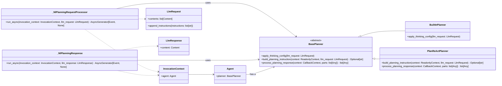

# `BasePlanner` 概覽

[`BasePlanner`](%2Fgoogle%2Fadk-python%2Fsrc%2Fgoogle%2Fadk%2Fplanners%2Fbase_planner.py#L27) 是一個抽象類別，作為在 ADK 中定義規劃策略的基礎。它允許在將 [`LlmRequest`](%2Fgoogle%2Fadk-python%2Fsrc%2Fgoogle%2Fadk%2Fmodels%2Fllm_request.py#L49) 物件傳送至大型語言模型 (LLM) 之前進行修改，以及在收到 [`LlmResponse`](%2Fgoogle%2Fadk-python%2Fsrc%2Fgoogle%2Fadk%2Fmodels%2Fllm_response.py#L28) 物件之後進行修改。

這在 [`_NlPlanningRequestProcessor`](%2Fgoogle%2Fadk-python%2Fsrc%2Fgoogle%2Fadk%2Fflows%2Fllm_flows%2F_nl_planning.py#L39) 和 [`_NlPlanningResponse`](%2Fgoogle%2Fadk-python%2Fsrc%2Fgoogle%2Fadk%2Fflows%2Fllm_flows%2F_nl_planning.py#L69) 中顯而易見，它們利用 [`BasePlanner`](%2Fgoogle%2Fadk-python%2Fsrc%2Fgoogle%2Fadk%2Fplanners%2Fbase_planner.py#L27) 分別注入規劃指令和處理來自回應的規劃相關資訊，如 [自然語言規劃與代理身份處理器](#llm-interaction_flows-and-orchestration-request-and-response-processing-pipeline-natural-language-planning-and-agent-identity-processors) 中所述。

## 核心互動

- **請求處理**: [`_NlPlanningRequestProcessor`](%2Fgoogle%2Fadk-python%2Fsrc%2Fgoogle%2Fadk%2Fflows%2Fllm_flows%2F_nl_planning.py#L39) 使用 [`BasePlanner`](%2Fgoogle%2Fadk-python%2Fsrc%2Fgoogle%2Fadk%2Fplanners%2Fbase_planner.py#L27)（特別是 [`PlanReActPlanner`](%2Fgoogle%2Fadk-python%2Fsrc%2Fgoogle%2Fadk%2Fplanners%2Fplan_re_act_planner.py#L33)）來建立規劃指令，並在 LLM 呼叫之前將其附加到 [`LlmRequest`](%2Fgoogle%2Fadk-python%2Fsrc%2Fgoogle%2Fadk%2Fmodels%2Fllm_request.py#L49) 中。
- **回應處理**: 同樣地，[`_NlPlanningResponse`](%2Fgoogle%2Fadk-python%2Fsrc%2Fgoogle%2Fadk%2Fflows%2Fllm_flows%2F_nl_planning.py#L69) 使用 [`BasePlanner`](%2Fgoogle%2Fadk-python%2Fsrc%2Fgoogle%2Fadk%2Fplanners%2Fbase_planner.py#L27) 來後續處理 [`LlmResponse`](%2Fgoogle%2Fadk-python%2Fsrc%2Fgoogle%2Fadk%2Fmodels%2Fllm_response.py#L28) 的內容部分。

## 使用方式

規劃器（例如 [`PlanReActPlanner`](%2Fgoogle%2Fadk-python%2Fsrc%2Fgoogle%2Fadk%2Fplanners%2Fplan_re_act_planner.py#L33)）可以與代理關聯，以引導 LLM 的行為。例如，[`_NlPlanningRequestProcessor`](%2Fgoogle%2Fadk-python%2Fsrc%2Fgoogle%2Fadk%2Fflows%2Fllm_flows%2F_nl_planning.py#L39) 可以為 [`PlanReActPlanner`](%2Fgoogle%2Fadk-python%2Fsrc%2Fgoogle%2Fadk%2Fplanners%2Fplan_re_act_planner.py#L33) 注入指令，以引導 LLM 完成「思考-行動-觀察」的循環。

## 功能說明

[`BasePlanner`](%2Fgoogle%2Fadk-python%2Fsrc%2Fgoogle%2Fadk%2Fplanners%2Fbase_planner.py#L27) 提供了以下方法：
*   將思考設定應用於 [`LlmRequest`](%2Fgoogle%2Fadk-python%2Fsrc%2Fgoogle%2Fadk%2Fmodels%2Fllm_request.py#L49)。
*   為 [`LlmRequest`](%2Fgoogle%2Fadk-python%2Fsrc%2Fgoogle%2Fadk%2Fmodels%2Fllm_request.py#L49) 建立規劃指令。
*   處理來自 [`LlmResponse`](%2Fgoogle%2Fadk-python%2Fsrc%2Fgoogle%2Fadk%2Fmodels%2Fllm_response.py#L28) 的規劃回應。

程式碼顯示，如果一個代理擁有規劃器，[`_NlPlanningRequestProcessor`](%2Fgoogle%2Fadk-python%2Fsrc%2Fgoogle%2Fadk%2Fflows%2Fllm_flows%2F_nl_planning.py#L39) 和 [`_NlPlanningResponse`](%2Fgoogle%2Fadk-python%2Fsrc%2Fgoogle%2Fadk%2Fflows%2Fllm_flows%2F_nl_planning.py#L69) 將會使用它來影響 LLM 的請求並解讀其回應。

## Mermaid 類別圖

