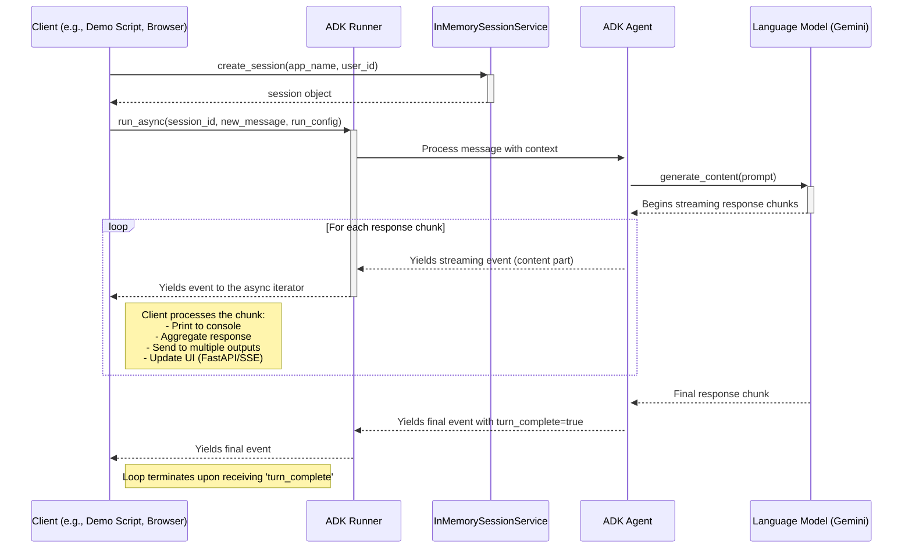

# Streaming Agent Demos - 流程時序圖

此文件包含一個時序圖，說明本目錄中各個展示腳本 (`demos`) 所示範的串流 Agent 的核心工作流程。

## 核心流程時序圖

此圖表展示了從客戶端發起請求到接收串流回應的完整生命週期。它涵蓋了 `basic`, `advanced`, `chat`, 和 `fastapi` 等所有展示模式中的主要互動。

## 流程說明

1.  **會話建立 (Session Creation)**:
    *   在與 Agent 互動之前，客戶端會向 `InMemorySessionService` 請求建立一個新的會話 (`session`)。
    *   此會話用於在多次對話之間保持上下文的連續性。

2.  **非同步執行 (Streaming Request)**:
    *   客戶端呼叫 `runner.run_async()`，並傳入會話 ID、使用者的新訊息以及一個 `RunConfig` 物件。
    *   `RunConfig` 指定了串流模式，在這些展示中通常是 `StreamingMode.SSE` (Server-Sent Events)。
    *   `Runner` 負責協調 `Agent` 和 `SessionService` 之間的互動。

3.  **串流回應 (Streaming Response)**:
    *   `Agent` 將請求傳遞給後端的語言模型 (LLM)，例如 Gemini。
    *   LLM 開始以字塊 (chunks) 的形式生成回應，並將其串流回 `Agent`。
    *   `Agent` 將每個字塊封裝成一個事件 (`event`)，並透過 `Runner` 的非同步迭代器 (`async for`) 將其傳回給客戶端。
    *   客戶端在每次迭代中接收一個事件，並可以立即處理它。不同的展示腳本在此階段有不同的處理方式：
        *   **`basic_streaming_demo.py`**: 直接將字塊印出到控制台。
        *   **`advanced_patterns_demo.py`**: 展示了四種模式：
            1.  **回應聚合**: 將所有字塊收集到一個列表中，最後組合成完整的回應。
            2.  **進度指示器**: 在接收字塊的同時顯示進度符號。
            3.  **多重輸出**: 將每個字塊同時發送到多個目的地 (例如，控制台和檔案)。
            4.  **超時保護**: 為串流過程設定一個超時限制。
        *   **`fastapi_sse_demo.py`**: 將每個字塊格式化為 SSE 事件，並透過 HTTP 串流到網頁客戶端。
        *   **`streaming_chat_app.py`**: 即時更新聊天 UI，實現打字機效果。

4.  **完成 (Completion)**:
    *   當 LLM 完成所有回應的生成後，`Agent` 會發送一個特殊的事件，其中 `turn_complete` 標誌為 `true`。
    *   客戶端的 `async for` 迴圈在收到此事件後終止，表示一次完整的對話回合結束。

這個核心流程是所有串流 Agent 的基礎，不同的應用場景只是在客戶端如何處理這些即時事件上有所區別。
