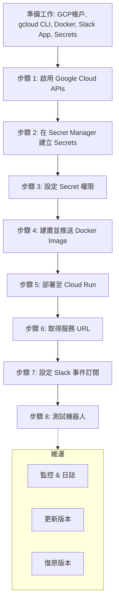

# 生產環境部署指南：將 Support Bot 部署至 Google Cloud Run

本指南將帶領您將 ADK Support Bot 部署至 Google Cloud Run，以實現 24/7 全天候可用性。

## 先決條件 (Prerequisites)

1. **Google Cloud 帳戶** (已啟用計費功能)
2. **gcloud CLI** (已安裝並驗證)：
   ```bash
   gcloud auth login
   gcloud config set project YOUR_PROJECT_ID
   ```
3. **Docker** (已在本地安裝)
4. **Slack App** (已建立並配置 Socket Mode，請參閱 Tutorial 33 README 步驟 1-4)
5. **已準備好 Secrets**：
   - `SLACK_BOT_TOKEN` (以 `xoxb-` 開頭)
   - `SLACK_APP_TOKEN` (以 `xapp-` 開頭)
   - `GOOGLE_API_KEY` (Gemini API 金鑰)

## 步驟 1：啟用所需的 Google Cloud APIs

```bash
gcloud services enable run.googleapis.com \
  iam.googleapis.com \
  artifactregistry.googleapis.com \
  cloudresourcemanager.googleapis.com
```

## 步驟 2：在 Secret Manager 中建立 Secrets

安全地儲存 secrets，而不是將它們寫死在環境變數中。

```bash
# 建立 secrets (一次性設定)
echo -n "YOUR_SLACK_BOT_TOKEN" | \
  gcloud secrets create SLACK_BOT_TOKEN --data-file=-

echo -n "YOUR_SLACK_APP_TOKEN" | \
  gcloud secrets create SLACK_APP_TOKEN --data-file=-

echo -n "YOUR_GOOGLE_API_KEY" | \
  gcloud secrets create GOOGLE_API_KEY --data-file=-
```

若要在日後更新 secret：
```bash
echo -n "NEW_TOKEN" | \
  gcloud secrets versions add SLACK_BOT_TOKEN --data-file=-
```

## 步驟 3：設定 Secret 權限

授權 Cloud Run 服務帳戶 (service account) 存取 secrets：

```bash
PROJECT_ID=$(gcloud config get-value project)
PROJECT_NUMBER=$(gcloud projects describe $PROJECT_ID --format='value(projectNumber)')
SERVICE_ACCOUNT="${PROJECT_NUMBER}-compute@developer.gserviceaccount.com"

# 授予 Secret Accessor 角色
for secret in SLACK_BOT_TOKEN SLACK_APP_TOKEN GOOGLE_API_KEY; do
  gcloud secrets add-iam-policy-binding $secret \
    --member=serviceAccount:${SERVICE_ACCOUNT} \
    --role=roles/secretmanager.secretAccessor
done
```

## 步驟 4：建置並推送容器映像檔 (Container Image)

設定您的專案 ID 和區域 (Region)：

```bash
export PROJECT_ID=$(gcloud config get-value project)
export REGION=us-central1  # 或您偏好的區域
export IMAGE="${REGION}-docker.pkg.dev/${PROJECT_ID}/support-bot/bot:latest"
```

建置 Docker 映像檔：

```bash
docker build -t ${IMAGE} .
```

推送到 Artifact Registry：

```bash
# 首先，確保您可以推送 (設定 Docker 驗證)
gcloud auth configure-docker ${REGION}-docker.pkg.dev

# 推送映像檔
docker push ${IMAGE}
```

或者，使用 **Container Registry (GCR)**：

```bash
export IMAGE="gcr.io/${PROJECT_ID}/support-bot:latest"
docker build -t ${IMAGE} .
docker push ${IMAGE}
```

## 步驟 5：部署至 Cloud Run

部署服務並參照 secrets：

```bash
gcloud run deploy support-bot \
  --image ${IMAGE} \
  --region ${REGION} \
  --platform managed \
  --allow-unauthenticated \
  --port 8080 \
  --set-secrets SLACK_BOT_TOKEN=SLACK_BOT_TOKEN:latest \
  --set-secrets SLACK_APP_TOKEN=SLACK_APP_TOKEN:latest \
  --set-secrets GOOGLE_API_KEY=GOOGLE_API_KEY:latest \
  --set-env-vars ENVIRONMENT=production,PORT=8080 \
  --memory 512Mi \
  --cpu 1 \
  --timeout 3600
```

主要選項說明：
- `--allow-unauthenticated`：Slack 必須能公開存取此服務。若您需要驗證，請改用 IAP。
- `--set-secrets`：將環境變數名稱對應到 Secret Manager 中的 secrets。
- `--memory 512Mi --cpu 1`：根據您的工作負載進行調整。
- `--timeout 3600`：設定逾時時間為 1 小時 (Cloud Run 的上限)。

## 步驟 6：取得服務 URL

部署後，取得 Cloud Run 服務 URL：

```bash
SERVICE_URL=$(gcloud run services describe support-bot \
  --region ${REGION} \
  --platform managed \
  --format='value(status.url)')

echo "Service URL: ${SERVICE_URL}"
```

## 步驟 7：設定 Slack 事件訂閱 (Event Subscription)

1. 前往 [api.slack.com/apps](https://api.slack.com/apps)
2. 選擇您的應用程式
3. 點擊 **Event Subscriptions**
4. 將 **Request URL** 設定為：
   ```
   ${SERVICE_URL}/slack/events
   ```
5. 點擊 **Verify URL** (Slack 將發送驗證請求到您的服務)
6. 儲存變更

如果驗證失敗：
- 確保已設定 `--allow-unauthenticated`
- 檢查 Cloud Run log：`gcloud logging read "resource.type=cloud_run_revision AND resource.labels.service_name=support-bot" --limit 50`

## 步驟 8：測試機器人

在您的 Slack 工作區中，提及 (mention) 機器人：

```
@Support Bot help
@Support Bot What is the password reset procedure?
@Support Bot Create a ticket for my laptop is slow
```

預期行為：
- 機器人在 1-2 秒內回應 (Cloud Run 冷啟動可能需要約 5 秒)
- 回應出現在頻道或討論串 (thread) 中

## 監控與日誌 (Monitoring & Logging)

### 查看 Cloud Run 日誌

```bash
gcloud logging read \
  "resource.type=cloud_run_revision AND \
   resource.labels.service_name=support-bot" \
  --limit 50 --format json
```

### 設定警報 (Alerts)

使用 Cloud Monitoring 來針對以下情況發出警報：
- 高錯誤率
- 回應時間緩慢
- 高記憶體使用量

### 即時串流日誌

```bash
gcloud logging read \
  "resource.type=cloud_run_revision AND \
   resource.labels.service_name=support-bot" \
  --follow --format='table(timestamp,textPayload)'
```

## 更新機器人

要重新部署新版本：

```bash
# 使用新標籤重新建置映像檔
docker build -t ${IMAGE} .
docker push ${IMAGE}

# 重新部署
gcloud run deploy support-bot \
  --image ${IMAGE} \
  --region ${REGION} \
  --platform managed \
  [... 與之前相同的選項 ...]
```

Cloud Run 會自動將流量逐漸導向新版本 (無停機時間)。

## 復原 (Rollback)

如果發生問題，可復原到先前的版本：

```bash
gcloud run rollbacks run support-bot \
  --region ${REGION} \
  --platform managed
```

或者手動重新部署舊的映像檔標籤。

## 成本最佳化

- **免費層級**：每月最多 200 萬次請求，360,000 GB-秒的運算時間
- **用量計費**：每 100 萬次請求約 $0.40 + 運算時間
- **提示**：
  - 如果您的機器人很輕量，請使用 `--memory 256Mi`
  - 如果大多數請求完成得很快，請設定 `--timeout 60`
  - 使用並發 (concurrency) 設定來調整請求處理

## 疑難排解

### Slack 無法驗證 URL

- 確保部署時已設定 `--allow-unauthenticated`
- 檢查您的機器人是否實作了 `/slack/events` 端點
- 查看 Cloud Run log 以檢視驗證請求

### 機器人沒有回應

- 檢查 secrets 是否正確綁定 (在 Cloud Run 服務詳細資訊中驗證環境變數)
- 檢查 agent import：`python -m support_bot.agent` 應該要在本地端運作正常
- 檢視 log 是否有錯誤

### 逾時錯誤 (Timeout errors)

- 增加 `--timeout` (例如，設定為 300 以獲得 5 分鐘)
- 檢查 agent 是否正在進行長時間執行的外部呼叫
- 在本地端分析 agent 以最佳化回應時間

### 記憶體不足 (Out of memory)

- 增加 `--memory` (嘗試 512Mi 或 1Gi)
- 檢查 agent 是否正在載入大型知識庫

## 下一步

1. **新增 Dockerfile** (如果尚未存在)
2. **設定 CI/CD** (Cloud Build) 以在 git push 時自動部署
3. **新增監控儀表板** 以監控請求率、延遲、錯誤
4. **排程定期重啟** 以增強安全性 (使用 Cloud Scheduler)
5. **啟用 VPC 連接器** (如果您需要存取私有資源)

## 延伸閱讀

- [Google Cloud Run 文件](https://cloud.google.com/run/docs)
- [Secret Manager 指南](https://cloud.google.com/secret-manager/docs)
- [Slack Bolt 文件](https://docs.slack.dev/tools/bolt-python/)
- [ADK 文件](https://google.github.io/adk-docs/)

---

## 部署流程圖



## 重點摘要

- **核心概念**：將 Support Bot 部署至 Google Cloud Run 的完整流程。
- **關鍵技術**：
    - **Google Cloud Run**：用於託管容器化應用程式。
    - **Secret Manager**：安全地管理敏感資訊 (Token, API Key)。
    - **Docker**：建置應用程式容器。
    - **Slack App**：配置 Socket Mode 和事件訂閱以與機器人互動。
- **重要結論**：使用 Secret Manager 管理憑證比環境變數更安全；Cloud Run 提供自動擴展和無伺服器架構，適合部署聊天機器人。
- **行動項目**：
    1. 確保所有先決條件 (GCP, Docker, Slack App) 皆已就緒。
    2. 依序執行步驟 1-8 進行部署。
    3. 設定監控和日誌以確保服務穩定性。
