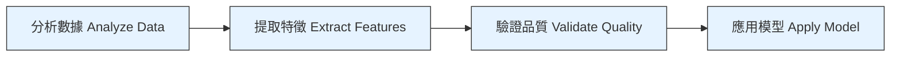
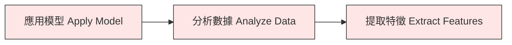

# 工具使用品質評估 (Tool Use Quality Evaluation) - TIL 實作

針對 ADK 1.16 中的 **基於評量表的工具使用品質指標 (Rubric Based Tool Use Quality Metric)** 的快速入門實作。

## 什麼是工具使用品質 (Tool Use Quality)？

工具使用品質評估代理 (Agent) **如何 (HOW)** 使用其工具，這與它們 **完成什麼 (WHAT)** 是分開的。

### 範例

您的代理可能會：
- ✅ 得到正確答案 (最終回應品質高)
- ❌ 亂序使用工具 (工具使用品質低)

**工具使用品質可以捕捉到這一點！**

## 此實作內容

展示了一個具有正確工具排序的 **數據分析工作流程**：

### 良好的順序 (Good Sequence)


(每個步驟都依賴於前一個步驟的輸出)

### 不良的順序 (Bad Sequence)


(順序錯誤，未滿足先決條件)


## 快速入門 (Quick Start)

### 設定 (Setup)

```bash
make setup
export GOOGLE_API_KEY=your_key_here
make test
```

### 執行真實評估 (Run Real Evaluation) ⭐

```bash
make evaluate
```

這實際上會 **呼叫 ADK 評估框架** 來評估工具排序：

```
📝 測試案例
- good_sequence_complete_pipeline: 所有 4 個工具按正確順序排列
- bad_sequence_skipped_validation: 缺少驗證步驟
- good_sequence_proper_analysis: 部分但正確的流程

🔍 正在執行評估
- 建立 3 個具有預期工具順序的測試案例
- LLM 評審 (Judge) 根據 4 個自定義評量表進行評估
- 報告分數與閾值 (需要 0.7)
- 顯示預期與實際工具呼叫的比較 (並排顯示)

結果
- 分數: 0.25 (低於 0.7 閾值 = 失敗)
- 原因: 測試代理不符合預期的工具順序
```

**`make evaluate` 執行的操作：**

```python
# 1. 建立具有基於評量表的工具使用品質指標的評估配置
config = {
    "criteria": {
        "rubric_based_tool_use_quality_v1": {
            "threshold": 0.7,
            "judge_model": "gemini-2.5-flash",
            "rubrics": [
                "proper_tool_order",      # 提取前先分析
                "complete_pipeline",      # 包含所有 4 個工具
                "validation_before_model", # 應用前先檢查品質
                "no_tool_failures"        # 所有呼叫皆成功
            ]
        }
    }
}

# 2. 建立具有好/壞工具順序的測試案例
evalset = {
    "eval_cases": [
        {
            "eval_id": "good_sequence",
            "tool_uses": [
                {"name": "analyze_data", ...},
                {"name": "extract_features", ...},
                {"name": "validate_quality", ...},
                {"name": "apply_model", ...}
            ]
        },
        {
            "eval_id": "bad_sequence",
            "tool_uses": [
                {"name": "extract_features", ...},
                {"name": "apply_model", ...}
                # 缺少: analyze_data 和 validate_quality!
            ]
        }
    ]
}

# 3. 執行評估
results = await AgentEvaluator.evaluate(
    agent_module="tool_use_evaluator",
    eval_dataset_file_path_or_dir="tool_use_quality.evalset.json",
)

# 4. LLM 評審評估工具順序
# - 對於每個測試案例，評審會根據 4 個評量表進行檢查
# - 產生每個評量表的分數 (1.0 = 通過, 0.0 = 失敗)
# - 計算總分 (評量表分數的平均值)
# - 回傳預期與實際呼叫的詳細比較

# 5. 報告結果
# 預期閾值: 0.7, 實際: 0.25 → 失敗 (FAILED)
# (代理未按預期順序使用工具)
```

### 啟動網頁介面 (Launch Web UI)

```bash
make dev
```

然後開啟 `http://localhost:8000` 並選擇 `tool_use_evaluator`。

### 測試提示詞 (Test Prompts)

**良好的工具使用** (展示正確排序)：
```
"Analyze customer_data, extract features, validate quality, then apply random_forest model"
```

**不良的工具使用** (展示錯誤排序)：
```
"Apply the model first, then analyze the data, then extract features"
```

## 檔案結構

```
tool-use-evaluator/
├── tool_use_evaluator/          # 代理實作
│   ├── __init__.py              # 套件初始化
│   ├── agent.py                 # 具有 4 個工具的主代理
│   └── .env.example             # 環境變數範本
├── tests/
│   ├── test_agent.py            # 代理與工具測試
│   ├── test_imports.py          # 匯入與結構測試
│   └── test_structure.py        # 應用程式配置測試
├── app.py                       # ADK 應用程式配置
├── Makefile                     # 開發指令
├── requirements.txt             # 依賴項
├── pyproject.toml              # Python 專案配置
└── README.md                   # 本文件
```

## 代理 (The Agent)

### 代理配置

```python
root_agent = Agent(
    name="tool_use_evaluator",
    model="gemini-2.0-flash",
    description="用於展示工具使用品質評估的代理",
    instruction="""
    當被要求分析數據時：
    1. 首先：分析資料集
    2. 接著：提取特徵
    3. 然後：驗證品質
    4. 最後：應用模型

    此順序展示了正確的工具排序。
    """,
    tools=[
        analyze_data,
        extract_features,
        validate_quality,
        apply_model,
    ],
)
```

### 包含的工具

1. **analyze_data(dataset: str)**
   - 分析資料集
   - 特徵提取的先決條件
   - 回傳分析元數據 (metadata)

2. **extract_features(data: dict)**
   - 從分析中提取特徵
   - 依賴 analyze_data 的輸出
   - 驗證的先決條件

3. **validate_quality(features: dict)**
   - 驗證特徵品質
   - 依賴 extract_features 的輸出
   - 應在應用模型之前呼叫

4. **apply_model(features: dict, model: str)**
   - 將機器學習 (ML) 模型應用於特徵
   - 依賴經過驗證的特徵
   - 流程中的最後一步

## 測試 (Testing)

### 執行所有測試

```bash
make test
```

### 測試結果

預期輸出：
```
test_agent.py::TestAgentConfiguration::test_agent_name PASSED
test_agent.py::TestAgentConfiguration::test_agent_has_tools PASSED
test_agent.py::TestToolFunctionality::test_analyze_data_success PASSED
test_agent.py::TestToolFunctionality::test_extract_features_success PASSED
...

20 passed in 0.42s
```

### 測試覆蓋率

```bash
pytest tests/ --cov=tool_use_evaluator --cov-report=html
# 開啟 htmlcov/index.html 查看覆蓋率
```

## 評估概念 (Evaluation Concepts)

### 真實評估的作用

`make evaluate` 指令使用 ADK 的 `AgentEvaluator` 來：

1. **載入您的代理** - 匯入 tool_use_evaluator 模組
2. **建立測試案例** - 產生包含預期工具順序的 evalset.json
3. **定義評量表** - 4 個工具品質評估標準
4. **執行評估** - 呼叫 Gemini 模型作為 LLM 評審
5. **評分結果** - 產生 0.0-1.0 的工具使用品質分數
6. **報告差異** - 顯示預期與實際工具呼叫的比較

### 工具使用品質 vs 最終回應品質

| 面向         | 工具使用 (Tool Use)      | 最終回應 (Final Response) |
| ------------ | ------------------------ | ------------------------- |
| **評估**     | **如何** 使用工具        | 答案 **是否** 正確        |
| **關注點**   | 工具順序、依賴關係       | 答案準確性、完整性        |
| **捕捉**     | 錯誤的工具順序、遺漏步驟 | 錯誤的最終答案            |
| **閾值**     | 通常 0.7-0.8             | 通常 0.7-0.85             |
| **分數意義** | 0.9 = 完美的順序         | 0.9 = 非常準確的答案      |

**範例：**

```
代理產生正確的報告但：
- 亂序呼叫工具 (順序顛倒)
- 跳過驗證步驟
- 使用效率低的資料來源

最終回應分數: ✅ 高 (答案正確)
工具使用品質分數: ❌ 低 (工具順序不佳)

典型情況 (僅檢查最終答案):
  ✅ 測試通過 - 代理得到正確答案

使用工具使用品質:
  ❌ 測試失敗 - 代理使用工具的方式很差
  (即使答案是對的！)
```

### 評量表評分 (Rubric Scoring)

分數: 0.0 - 1.0

- **1.0**: 完美的工具使用 (正確的工具，正確的順序)
- **0.8**: 非常好 (輕微的效率低落)
- **0.5**: 尚可 (答案正確，工具選擇不佳)
- **0.0**: 失敗 (錯誤的工具，錯誤的順序)

## 與您自己的代理整合

使用相同的框架來評估您的代理的工具使用品質：

### 步驟 1：定義您的評量表

```python
# 您的工作流程中「良好的工具使用」是什麼樣的
rubrics = [
    {
        "rubric_id": "proper_order",
        "rubric_content": {
            "text_property": "Tools are called in logical order"
        }
    },
    {
        "rubric_id": "complete_workflow",
        "rubric_content": {
            "text_property": "All necessary tools are included"
        }
    }
]
```

### 步驟 2：建立測試案例 (evalset.json)

```python
evalset = {
    "eval_cases": [
        {
            "eval_id": "good_sequence",
            "conversation": [{
                "user_content": {...},
                "intermediate_data": {
                    "tool_uses": [
                        {"name": "tool1", ...},
                        {"name": "tool2", ...}
                    ]
                }
            }]
        }
    ]
}
```

### 步驟 3：執行評估

```python
from google.adk.evaluation.agent_evaluator import AgentEvaluator

results = await AgentEvaluator.evaluate(
    agent_module="your_agent",
    eval_dataset_file_path_or_dir="evalset.json",
)
```

### 真實世界範例 (完整流程)

```python
# 這就是 `make evaluate` 內部實際執行的操作：

import asyncio
from google.adk.evaluation.agent_evaluator import AgentEvaluator

async def evaluate_tool_use():
    # 1. 建立包含測試案例的 evalset
    evalset = create_test_cases()  # 良好/不良順序

    # 2. 建立具有基於評量表指標的評估配置
    config = {
        "criteria": {
            "rubric_based_tool_use_quality_v1": {
                "threshold": 0.7,
                "judge_model_options": {
                    "judge_model": "gemini-2.5-flash",
                    "num_samples": 3
                },
                "rubrics": [
                    {"rubric_id": "proper_tool_order", ...},
                    {"rubric_id": "complete_pipeline", ...},
                    ...
                ]
            }
        }
    }

    # 3. 執行評估
    results = await AgentEvaluator.evaluate(
        agent_module="tool_use_evaluator",
        eval_dataset_file_path_or_dir="tool_use_quality.evalset.json",
    )

    # 4. 解讀結果
    # - 分數: 0.0-1.0
    # - 顯示預期與實際工具呼叫
    # - 每個評量表的分數
    # - 通過/失敗與閾值

    print(f"Score: {results.score}")
    print(f"Status: {'PASS' if results.score >= 0.7 else 'FAIL'}")
    return results

asyncio.run(evaluate_tool_use())
```

## 環境變數

從 `.env.example` 建立 `tool_use_evaluator/.env`：

```bash
GOOGLE_API_KEY=your_google_api_key_here
```

Vertex AI 選項 (可選)：
```
GOOGLE_GENAI_USE_VERTEXAI=true
GOOGLE_CLOUD_PROJECT=your-project-id
```

## 指令 (Commands)

```bash
make setup       # 安裝與配置
make test        # 執行單元測試 (驗證配置)
make evaluate    # 展示 RUBRIC_BASED_TOOL_USE_QUALITY_V1 評估 ⭐
make dev         # 啟動 ADK 網頁介面以測試工具使用
make demo        # 快速驗證 (無需網頁介面)
make clean       # 移除快取檔案和產物
make help        # 顯示所有指令
```

### `make evaluate` 指令 (新功能 - 真實評估！)

與顯示靜態範例的 `make demo` 不同，`make evaluate` 執行 **實際評估**：

```bash
$ make evaluate

📝 測試案例摘要 (TEST CASES SUMMARY)
測試案例 1: good_sequence_complete_pipeline
  預期分數: 0.95-1.0 (優秀)
  原因: 所有步驟順序正確，滿足所有評量表

測試案例 2: bad_sequence_skipped_validation
  預期分數: 0.25-0.4 (差)
  原因: 跳過關鍵步驟，違反評量表

測試案例 3: good_sequence_proper_analysis
  預期分數: 0.8-0.9 (好)
  原因: 順序正確但未應用模型 (對於僅分析任務可接受)

📁 正在建立測試 evalset 檔案...
   ✓ 已建立: tool_use_quality.evalset.json

================================================================================
真實評估: 基於評量表的工具使用品質 V1 (RUBRIC BASED TOOL USE QUALITY V1)
================================================================================

📋 評估配置
閾值: 0.7
評審模型: gemini-2.5-flash
評量表: 4
  • proper_tool_order: 代理在 extract_features 之前呼叫 analyze_data...
  • complete_pipeline: 依序呼叫所有 4 個工具...
  • validation_before_model: 建模前驗證品質...
  • no_tool_failures: 所有呼叫皆成功且參數正確...

🔍 正在執行評估
[LLM 評審根據 4 個評量表評估每個測試案例...]

摘要: `rubric_based_tool_use_quality_v1` 指標為 `EvalStatus.FAILED`。
預期閾值: `0.7`, 實際值: `0.25`。

[顯示以下的詳細表格:]
- eval_status: FAILED/PASSED
- score: 0.25 (低於閾值)
- expected_tool_calls: analyze_data → extract_features → validate_quality
- actual_tool_calls: [代理實際呼叫的比較]

⚠️  評估已執行但測試案例未達到評分閾值：
   這意味著評估框架運作正常！
   測試代理不符合預期的工具順序。

在真實場景中，您將會：
1. 檢視上述預期與實際工具呼叫
2. 調整代理指令以符合預期行為
3. 重新執行評估以查看分數是否提高
```

**主要差異：**

| 指令            | 目的       | 輸出               | API 呼叫        |
| --------------- | ---------- | ------------------ | --------------- |
| `make demo`     | 顯示範例   | 靜態展示配置       | 無              |
| `make dev`      | 互動式測試 | 具有聊天的網頁介面 | 無 (直到您聊天) |
| `make evaluate` | 真實評估   | 實際評估分數       | ✅ LLM 評審呼叫  |

**`make evaluate` 為何是真實的：**

1. ✅ 建立包含測試案例的 evalset.json
2. ✅ 建立包含評估配置的 test_config.json
3. ✅ 從 ADK 呼叫 `AgentEvaluator.evaluate()`
4. ✅ 使用 Gemini 模型作為 LLM 評審
5. ✅ 根據 4 個自定義評量表進行評估
6. ✅ 回傳實際分數 (0.0-1.0)
7. ✅ 顯示預期與實際工具呼叫的比較 (並排顯示)
8. ✅ 報告通過/失敗與閾值

## 開發 (Development)

### 在地端執行測試

```bash
# 執行所有測試
pytest tests/ -v

# 執行特定測試類別
pytest tests/test_agent.py::TestAgentConfiguration -v

# 執行並查看覆蓋率
pytest tests/ --cov=tool_use_evaluator -v
```

### 新增工具

1. 在 `tool_use_evaluator/agent.py` 中建立工具函數
2. 新增至代理的 `tools=[]` 清單
3. 在 `tests/test_agent.py` 中新增測試
4. 執行 `make test` 以驗證

### 除錯 (Debugging)

```bash
# 執行展示以檢查匯入
make demo

# 檢查代理載入
python -c "from tool_use_evaluator import root_agent; print(root_agent.name)"

# 啟動網頁介面進行互動式測試
make dev
```

## 檔案

**TIL 文章**: `workspace/notes/google-adk-training-hub/blog/2025-10-21-til-tool-use-quality.md`
- ADK 評估文件: https://google.github.io/adk-docs/
- 工具使用品質概念: 請參閱 TIL 文章
- 暫停/恢復 (Pause/Resume) TIL: 另一個 ADK 1.16 功能

## 常見問題

**問題**: `GOOGLE_API_KEY not set`
```bash
# 解決方案:
export GOOGLE_API_KEY=your_key_here
# 或新增至 tool_use_evaluator/.env
```

**問題**: `Module not found: tool_use_evaluator`
```bash
# 解決方案:
make setup
# 這會以開發模式安裝套件
```

**問題**: 測試失敗
```bash
# 解決方案:
make clean
make setup
make test
```

## 下一步

1. ✅ 了解工具排序概念 (閱讀 TIL)
2. ✅ 執行實作測試 (`make test`)
3. ✅ 使用網頁介面進行測試 (`make dev`)
4. ✅ 調整為您代理的工具
5. ✅ 將評估整合到 CI/CD 管道

## 相關資源

- **TIL 文章**: 工具使用品質指標指南
- **教學 19**: 完整評估框架
- **ADK 文件**: 評估與指標參考

## 授權

ADK Training 專案的一部分。請參閱主存放庫以獲取授權。

---

### 重點摘要

- **核心概念**：工具使用品質 (Tool Use Quality) 評估代理如何使用工具（例如順序、依賴關係），而不僅僅是最終結果的正確性。
- **關鍵技術**：
    - **ADK AgentEvaluator**：用於執行自動化評估。
    - **Rubric Based Evaluation**：基於自定義評量表（如工具順序、完整性）進行評分。
    - **LLM as Judge**：使用 LLM（如 Gemini）作為評審來分析工具呼叫紀錄。
- **重要結論**：
    - 即使最終答案正確，工具使用順序錯誤（如先應用模型再分析數據）也會導致低分。
    - `make evaluate` 指令展示了如何設定和執行這種基於評量表的自動化評估。
- **行動項目**：
    - 設定 `GOOGLE_API_KEY`。
    - 使用 `make evaluate` 運行範例評估。
    - 參考此範例為自己的代理定義評量表和測試案例。
