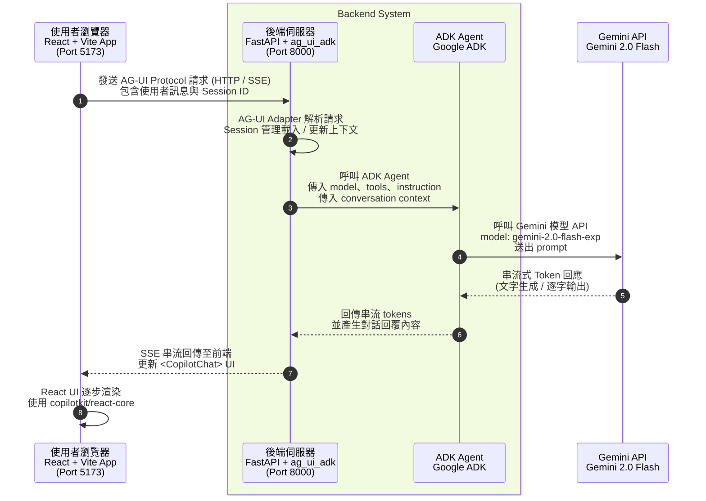
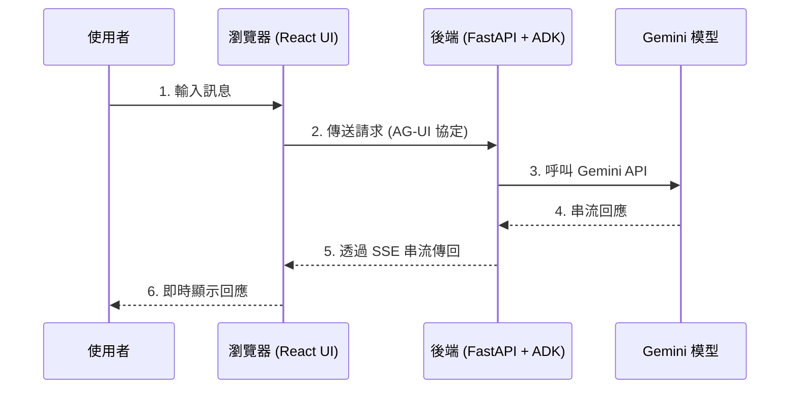

# 教學 29：UI 整合介紹 - 快速入門

這是一個最小化的實作，示範如何使用 AG-UI 協定 (AG-UI Protocol) 將 ADK 代理與 React UI 整合。此為教學 29 中的快速入門範例。

## 🚀 快速入門

```bash
# 1. 安裝依賴項
make setup

# 2. 設定 API 金鑰
cp agent/.env.example agent/.env
# 編輯 agent/.env 並加入您的 GOOGLE_API_KEY

# 3. 啟動後端與前端
make dev

# 4. 在瀏覽器中開啟 http://localhost:5173
```

## 📋 內容包含

這個最小化實作包含：

- ✅ **Python ADK 代理** - 簡單的對話式助理
- ✅ **FastAPI 後端** 與 AG-UI 整合
- ✅ **React + Vite 前端** 與 CopilotKit
- ✅ **即時聊天介面** 支援串流
- ✅ **完整的測試套件** (超過 15 個測試)
- ✅ **快速設定** (少於 10 分鐘)

## 🏗️ 架構



## 📁 專案結構

```
ui-integration/
├── agent/                      # Python 後端
│   ├── __init__.py
│   ├── agent.py               # ADK 代理 + FastAPI 應用程式
│   └── .env.example           # 環境變數範本
├── frontend/                  # React 前端
│   ├── src/
│   │   ├── App.tsx            # 使用 CopilotKit 的主要應用程式
│   │   ├── App.css            # 樣式
│   │   └── main.tsx           # 進入點
│   ├── package.json
│   ├── tsconfig.json
│   ├── vite.config.ts
│   └── index.html
├── tests/                     # 測試套件
│   ├── test_imports.py        # 匯入測試
│   ├── test_structure.py      # 結構測試
│   └── test_agent.py          # 代理測試
├── Makefile                   # 建置指令
├── requirements.txt           # Python 依賴項
├── pyproject.toml            # Python 專案設定
└── README.md                  # 本檔案
```

## 🎯 您將學到什麼

此實作展示了 UI Integration 的核心概念：

1. **AG-UI 協定整合** - 如何將 ADK 代理連接到 React UI
2. **最小化設定** - 最簡單的可行範例
3. **後端架構** - FastAPI + ag_ui_adk 模式
4. **前端架構** - React + CopilotKit 模式
5. **開發工作流程** - 從設定到運行應用程式

## 💬 嘗試這些提示

應用程式運行後，請嘗試：

- "什麼是 Google ADK？"
- "AG-UI 協定如何運作？"
- "解釋 UI 整合的優點"
- "你能幫我做什麼？"
- "告訴我不同的 UI 整合方法"

## 🧪 測試

```bash
# 執行所有測試
make test

# 測試驗證：
# - 所有匯入是否正常
# - 專案結構是否正確
# - 代理是否已正確設定
# - FastAPI 應用程式是否已正確設定
# - AG-UI 整合是否正常運作
```

## 🐛 故障排除

### 後端無法啟動

```bash
# 檢查 API 金鑰是否已設定
echo $GOOGLE_API_KEY

# 若未設定，請進行設定
cp agent/.env.example agent/.env
# 編輯 agent/.env 並填入您的 API 金鑰
export GOOGLE_API_KEY=your_key_here
```

### 前端無法連接到後端

1. 確認後端正在埠號 8000 上運行
2. 檢查 `agent/agent.py` 中是否已啟用 CORS
3. 確認前端的 `runtimeUrl` 與後端 URL 相符

### "ag_ui_adk not found" 錯誤

```bash
# 安裝 AG-UI ADK 套件
pip install ag-ui-adk
```

### 測試失敗

```bash
# 確保您位於 tutorial29 目錄中
cd tutorial_implementation/tutorial29

# 首先執行設定
make setup

# 然後執行測試
make test
```

## 📚 了解更多

這是一個最小化的快速入門範例。如需更進階的功能，請參閱：

- **教學 30**：Next.js + ADK，包含工具與進階功能
- **教學 31**：React Vite + ADK，包含更複雜的範例
- **教學 32**：Streamlit 直接整合
- **教學 33**：Slack 機器人整合

## 🔑 與教學 30 的主要差異

教學 29 (本篇)：
- 用於學習的最小化範例
- 無自訂工具 (僅對話)
- Vite + React (較簡單)
- 著重於整合模式

教學 30：
- 可用於生產環境的範例
- 多個自訂工具
- Next.js 15 (更多功能)
- 進階功能 (生成式 UI、人機回圈 (HITL)、共享狀態)

## 🎉 下一步是什麼？

現在您已了解基礎知識：

1. ✅ 您已了解 AG-UI 協定的運作方式
2. ✅ 您已了解後端/前端架構
3. ✅ 您可以設定並運行此整合

**後續步驟**：
- 為代理新增自訂工具 (請參閱教學 30)
- 部署至生產環境 (Cloud Run + Vercel)
- 實作進階功能 (生成式 UI、人機回圈)
- 嘗試其他整合方法 (Streamlit、Slack)

## 📝 備註

- 本內容基於教學 29 的快速入門部分
- 使用與教學文件完全相同的模式
- 所有程式碼均使用正確的 ADK v1.16+ Runner API 模式
- 已驗證可與最新版本的 ADK 和 CopilotKit 配合使用

---

**有任何問題或回饋？** 請在 [ADK 訓練儲存庫](https://github.com/raphaelmansuy/adk-training) 提交問題 (issue)。

### 重點摘要
- **核心概念**：本文件是一個快速入門指南，說明如何透過 **AG-UI 協定** 將一個基於 **Google ADK** 的 Python 代理與一個 **React** 前端進行最小化的整合。
- **關鍵技術**：
    - **Google ADK (Agent Development Kit)**：用於建構 AI 代理的框架。
    - **React (with Vite)**：用於建構使用者介面的前端函式庫。
    - **FastAPI**：一個高效能的 Python Web 框架，用於建構後端 API。
    - **CopilotKit**：一個前端工具，可輕鬆將 AI 聊天功能整合至 React 應用程式。
    - **AG-UI 協定**：一個專為代理與 UI 之間通訊設計的協定，支援 HTTP/SSE (Server-Sent Events) 以實現即時串流。
- **專案架構**：
    - **前端** (`frontend/`)：一個 React + Vite 應用程式，運行於埠號 5173，使用 CopilotKit 建立聊天介面。
    - **後端** (`agent/`)：一個 FastAPI 伺服器，運行於埠號 8000，負責託管 ADK 代理並透過 `/api/copilotkit` 端點與前端通訊。
    - **模型**：使用 `gemini-2.0-flash-exp` 作為底層語言模型。
- **行動項目**：
    - 使用 `make setup` 安裝所有依賴項。
    - 在 `agent/.env` 中設定 `GOOGLE_API_KEY`。
    - 執行 `make dev` 來同時啟動前後端伺服器。
    - 在瀏覽器中開啟 `http://localhost:5173` 來與 AI 代理互動。

### Mermaid 流程圖
